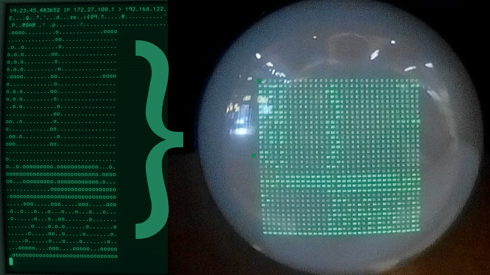
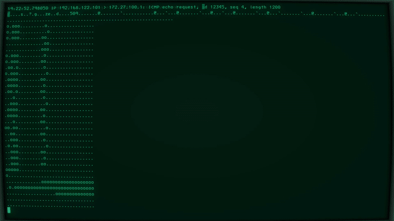
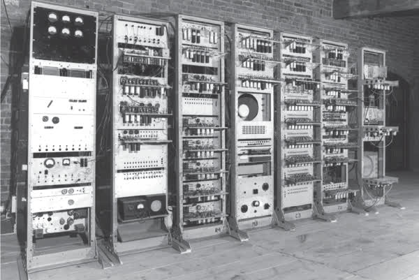

# A computer from 1948 in ICMP packets

## Errr, what?

[Manchester Baby](https://en.wikipedia.org/wiki/Manchester_Baby) was the very first stored program computer in the world [1]. Now it lives again, and in a pretty unusual place too: in-flight ICMP packets, aided by XDP ([eXpress Data Path](https://en.wikipedia.org/wiki/Express_Data_Path)) high-performance kernel networking magic. 


Scrolling the text 2022 to the right.

## How ?

1. ICMP packet is received by the XDP hook

2. It parses the ICMP payload, extracts the memory, program counter and accumulator state.

3. Using this information, it fetches and executes the next instruction

4. It writes the state back into the ICMP packet payload

5. XDP module changes an incoming ICMP echo response into request, swaps incoming and outgoing addresses to return it back to the sender, creating a potentially endless ping-pong exchange.

6. the ICMP packet is transmitted out for the next iteration


While the packet is in flight, the computer has no idea about it anymore, as no persistent storage is used - it only lives within the ICMP packet, using it for storing memory and state.

Because of this and XDP's incredible throughput and low overhead, you can have true multiprocessing, 1948. style.


---

## How do I try it out?

This is a possibly inaccurate tutorial which might differ for your distro a bit. 

1. Clone the GitHub repo
2. Install clang, llvm, make, kernel headers, libbpf-dev. I also needed gcc-multilib
3. Build it: ``` clang -O2 -g -Wall -target bpf -c baby.c -o baby.o ```
4. Load it (you might need to change network interface): ```ip link set eth0 xdpgeneric obj baby.o sec ssem ```
5. How to unload if needed? ``` ip link set eth0 xdpgeneric off ```
6. From that machine, run ``` start.py --target target_ip --program target_program ``` as root (sending raw ICMP packets requires additional permissions). 

  * Please note it is good practice to **inspect the source first**. Running things as root because a random person on the Internet told you so can be a bad idea.

Example:

``` bash# ./start.py --target 192.168.1.1 --program programs/scroll.ssem ```

Tcpdump:

You need ASCII mode flag, like this:

``` bash# tcpdump -i virbr0 -n icmp and dst 172.29.200.1 -A ```

## Display  CRT

Output was originally to a 32 x 32 dot [CRT Williams tube](https://en.wikipedia.org/wiki/Williams_tube), which is emulated by crafting the packet for inspection with *tcpdump*, printing 'o' where a pixel is lit and '.' where it isn't. Each row is followed by a newline which is respected and displayed properly by tcpdump in ASCII mode. This weird hackery is actually well aligned with display doubling as storage in the original machine.



## FAQ 

### What can be used as a target IP?

* Does it need to have some server software installed? No! It's any host that will respond to ping (and the admin won't mind).

### How do I stop this damn thing?

* ip link set eth0 xdpgeneric off

### This is not working, my tcpdump sees nothing!

* Packet never reaches the rest of kernel networking stack, its direction is reversed and it is sent right back. Try to e.g. tcpdump from the target.

### Why not use bpf_csum_diff? 

* I tried - it failed to work for a payload above 512 bytes. Weird!

### Just ... why?

* It's still better than doing drugs or JavaScript. :-)

## Execution speed

How fast is the computer running? It depends! Most of the time the packets are travelling back and forth, so the execution speed is directly proportional to the packet's round trip time. If you choose a very remote location with 250ms, you will get roughly 4 instructions per seconds and the speed will go up as you ping a location closer to you. Ping of 1.2 ms should roughly match the speed of the original machine.



Plotting a parabola.

## SSEM Computer

Small-scale Experimental Computer designed and built at Manchester University in 1948. was the world's first stored-program computer. Because it had just 32 words of memory and 7 instructions, it got the nickname *Baby* (Dirty Dancing was not a thing yet). 

It was really a proof-of-concept design, demonstrating that stored program computers were feasible and the architecture made sense. The first program was written by Tom Kilburn and executed on 21 June 1948. [2]. 

The memory was a rather unusual invention: the [Williams tube](https://en.wikipedia.org/wiki/Williams_tube), making the display output double as storage. 



It took ~1.2 ms to execute one instruction [3], so at 833 instructions per second it wasn't really breaking speed records. 

Note how opcodes [1] appear to count wrong in binary - this is because back then the most significant bit was to the right, not to the left!

Opcode        | Original Notation | Modern Notation |   Operation
------------  |    ------------   |  -------------  | -------------
   000        |       S, CI       |     JMP S       |  Unconditional jump to mem[S]
   100        |       Add S, CI   |     JRP S       |  Jump to PC + mem[S]   
   010        |       -S, C       |     LDN S       |  Negate mem[S] and store in ACC   
   110        |       c, S        |     STO S       |  Store ACC to S   
   001 or 101 |       SUB S       |     SUB S       |  Subtract mem[S] from ACC, store in ACC   
   011        |       Test        |     CMP         |  Skip next instruction if ACC negative   
   111        |       STOP        |     STP         |  Halt


"When first built, a program was laboriously inserted and the start switch pressed. Immediately the spots on the display tube entered a mad dance. In early trials it was a dance of death leading to no
useful result, and what was even worse, without yielding any clue as to what was wrong. But one day it stopped and there, shining brightly in the expected place, was the expected answer, It was a  moment to remember. This was in July 1948 and nothing was ever the same again." - F.C.Williams [4]


## References

1. Manchester Baby. (2022, January 15). In Wikipedia. https://en.wikipedia.org/wiki/Manchester_Baby
2. Chris Burton: "The Manchester Baby Reborn", IEE Review, May 1998, pp. 113-117
3. O’Regan, G. (2018). World of computing: A primer companion for the digital age (1st ed.). Springer International Publishing.
4. F.C.Williams: "Early computers at Manchester University", The Radio and Electronic Engineer, Vo1.45, No.7, July 1975, p. 327-331
   
